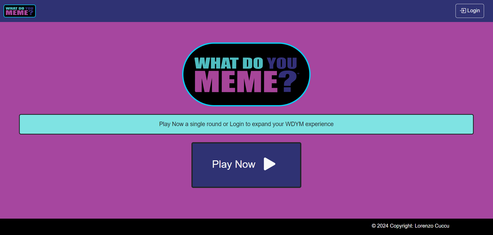
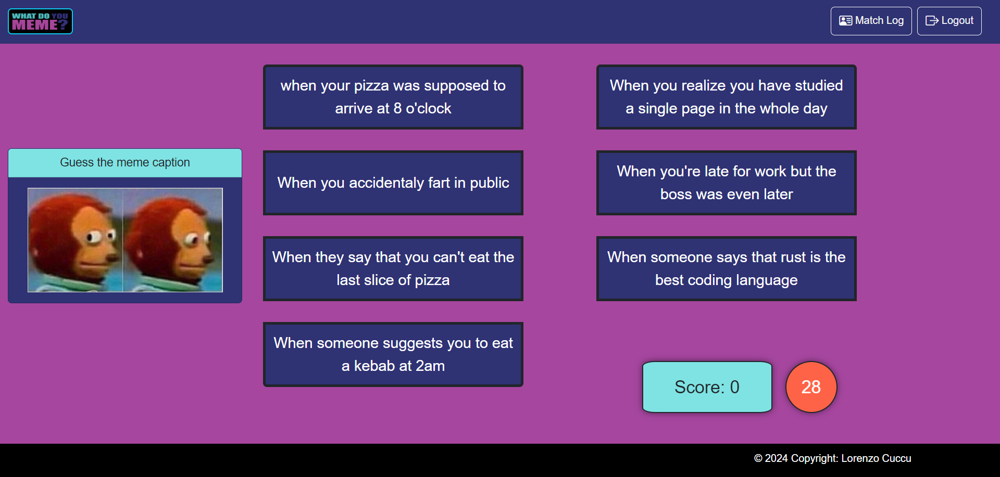

# Exam #1: "Gioco dei Meme"
## Student: s330260 CUCCU LORENZO 

## React Client Application Routes

- Route `/`: Home page of the application, its purpose is to let the user start playing or log in
  Contains:
  - Application logo with a brief description and the Start button. 

- Route `/login`: Login Page to let the user authenticate
  Contains:
  - The login Form

- Route `/profile`: User profile page with the history of the matches played by the user
  Contains:
  - The Main card of the user, with the username and the total score
  - The Matches cards, each one composed by total match score, the 3 rounds meme images with the associeted score gained and the caption selected by the user

- Route `/round`: The Main Page of the game, it rappresent a round of a single or multiple round match. It let the user play.
  Contains:
  - The Card with the image of the current match and an alert message shown when the user select a caption or the round time end (the message contains the response of the round)
  - 7 Buttons, each one containing a caption that can be selected
  - Timer, the timer of the round
  - Score, only visible for logged in users, it contains the updated score of the match

- Route `/round/end`: The end match recap page, with a recap of the Match done. It let the user play again or back home
  Contains:
  - The recap card with the total match score, the guessed memes and the caption selected for those memes. It contains also the buttons "play again" and "back home". In case the user is not logged in the card only contains the response of the single round, with no images, scores or captions.

## API Server

### API User Access

- POST `/api/sessions`
  - Request Parameters : None
  - Request Body :
    - `username`: the username of the user 
    - `password`: the password of the user
  - Response Body: 
    - `User` : a object that rapresents the logged in user

- GET `/api/sessions/current`
  - Request Parameters : None
  - Request Body : None
  - Response Body: 
    - `User` : a object that rapresents the logged in user

- DELETE `/api/sessions/current`
  - Request Parameters : None
  - Request Body : None
  - Response Body: None

### API Meme

- GET `/api/memes`: Takes a meme for the guest user
  - Request Parameters : None
  - Request Body : None
  - Response Body: 
    - `Meme` : A object rapresenting the meme of a single round match 

- GET `/api/memes/next`: Takes a meme for a logged in user
  - Request Parameters : None
  - Request Body : None
  - Response Body: 
    - `Meme` : A object rapresenting the meme of a sequence of three round match

- GET `/api/memes/:meme_id/captions`: Takes 7 captions for a meme (2 correct and 5 wrong)
  - Request Parameters : 
    - `meme_id`: the id of the meme we want to take the caption
  - Request Body : None
  - Response Body: 
    - `Captions` : An Array containing 2 right captions for the meme and 5 wrong caption randomly ordered 

- GET `/api/memes/:meme_id/captions/:cap_id`: Checks if a caption is correct or not for a specific meme
  - Request Parameters : 
    - `meme_id`: the id of the meme we want to check the captions
    - `meme_id`: the id of the caption we want to know if it's right
  - Request Body : None
  - Response Body: 
    - `bool` : a boolean value (true or false) according to the check of the caption for a meme

### API Match

- POST `/api/matches`: Records the match information
  - Request Parameters : None
  - Request Body :
    - `date`: the date of the registration
  - Response Body: 
    - `match_id` : the id of the match just registered

- POST `/api/matches/:match_id/round`: Records the round informations
  - Request Parameters : 
    - `match_id`: the id of the match the rounds are referred to
  - Request Body :
    - `img_id`: the id of the meme of the round
    - `cap_id`: the id of the caption selected on that round
    - `score`: the score of the round (0 or 5)
  - Response Body: None

- GET `/api/matches`: Takes the matches informations
  - Request Parameters : None
  - Request Body : None
  - Response Body: 
    - `Matches` : a array that contains all the matches of the logged in user

- GET `/api/matches/match_id/round`: Takes the rounds information of a specific match
  - Request Parameters : 
    - `match_id`: the id of the match we want to get the rounds
  - Request Body : None
  - Response Body: 
    - `RoundRecordings` : a array that contains all the rounds (3) referred to the match

- PUT `/api/matches/score`: Update the total score of a user
  - Request Parameters : None
  - Request Body :
    - `score`: the score of the match to add to the user total score
  - Response Body: None

- GET `/api/matches/score`: get the total score of a user
  - Request Parameters : None
  - Request Body : None
  - Response Body:
    - `score`: the total score of the logged in user
## Database Tables

- Table `users`:
  - uid: unique id of the user
  - username: username of the user
  - tot_score: total score obtaind by played matches
  - password: user hashed password
  - salt: security random bytes added to password to authenticate

- Table `memes`:
  - mmid: unique id of the meme
  - path: the folder path to the image

- Table `captions`:
  - cid: unique id of the caption
  - text: the text of the caption
  - ref_meme: reference to the meme id which the caption refers

- Table `matchresults`:
  - mrid: unique id of the match
  - date: the date when match was finished and registed (YYYY-MM-DD)
  - ref_user: reference to the user id who played the match

- Table `roundresults`:
  - rrid: unique id of the round
  - ref_match: reference to the match id which the round belong
  - ref_meme: reference to the meme id of the round
  - ref_caption: reference to the caption id selected by the player on that round

## Main React Components

- `Home` (in `Home.jsx`): It Contains the Play Button and allow the user to start a match. If the user is logged in it starts a 3 rounds match, if it is not it starts a single round match.

- `NavHeader` (in `NavHeader.jsx`): It is the navbar of the application, if the user is not logged in it only allows to log in, or back home (by clicking on the app logo). If the User is logged in it allows to Logout or access the user profile player, with the matches history.

- `LoginForm` (in `AuthComponents.jsx`): It is the Login form that allow the user to log in the application. It request username and password, both needed. 

- `Round` (in `Match.jsx`): It is layout of a round, it contains the image of the current round, 7 buttons containing the captions between the user can choose, the timer of the round, the alert that shows the response of the round when the user select a caption or the time end. Only if the user is logged in it shows also the updated score of the current match. It allows the user to play 'What do you meme'.

- `ProfileLog` (in `ProfileLog.jsx`): It is the profile of the user, containing the user card, with username and total score, and the cards of the matches played. Each match card contains the total match score and the recordings of the 3 rounds: meme image, caption selected, round score. It allows the logged in user to see his matches history 

(only _main_ components, minor ones may be skipped)

## Screenshot

## Users Credentials

- test, testtest, (60 points and 7 matches played)
- user1, password1 (45 points and 6 matches played)
- user2, password2 (5 points and 1 matches played)
